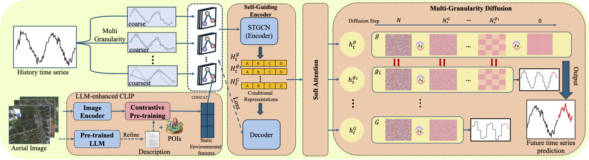
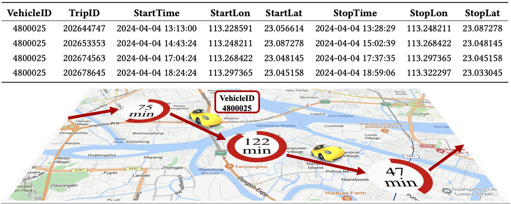

# MAEDE: A Multi-Granularity Self-Guiding Graph Diffusion Model for Predicting Regional Private Car Activity

## 📘 Overview
**MAEDE (Multi-grAnularity sElf-guiding Diffusion graph modEl)** is a unified framework for **probabilistic forecasting** of regional private car activity. MAEDE is designed to address the inherent stochasticity, multi-granularity temporal patterns, and complex environmental influences on private car movements within urban spaces.

By leveraging a **conditional diffusion backbone**, **LLM-enhanced visual-textual contrastive learning**, and a **multi-granularity self-guiding mechanism**, MAEDE captures both fine-grained variations and high-level temporal trends, outperforming state-of-the-art baselines.

<p align="center">
  
</p>

### 📄 Abstract
We propose MAEDE for probabilistic forecasting of regional private car activity. MAEDE leverages a conditional diffusion model to capture complex temporal dynamics and uncertainty in car behavior. To enhance static environmental understanding, it integrates satellite imagery and LLM-generated textual descriptions through contrastive learning. Furthermore, MAEDE introduces a multi-granularity self-guiding mechanism that uses coarse-to-fine targets to guide the denoising process. This design enables simultaneous modeling of short-term fluctuations and long-term trends. Evaluations on a large-scale private car dataset show significant improvements in predictive accuracy and robustness.

### 🧠 Model Highlights
- Diffusion-based probabilistic prediction
- Multi-granularity supervision (hourly, daily)
- Self-guiding Gated WaveNet encoder
- LLM-guided image-text contrastive urban representation

---

## 📊 Dataset Information

<p align="center">
  
</p>


We collected a large-scale private car trip dataset from three provincial capital cities in China: **Changsha**, **Guangzhou**, and **Shenzhen**. The data spans **March 1 to August 27, 2024**, and contains **1,871,959 trip records**.

The dataset reflects Arrive-Stay-Leave (ASL) behavior aggregated at the regional level and is used to train and evaluate regional activity prediction.

Due to privacy concerns, only partial (anonymized) data samples are included in this repository. For detailed dataset statistics and processing logic, refer to **Appendix A** of the paper.


### 🔐 Data Privacy & Ethics
We are acutely aware of the privacy implications of using mobility data for behavioral modeling. The following measures were strictly followed:

- ✅ Full authorization was obtained from both users and the data provider.
- ✅ Explicit user consent was collected at data generation.
- ✅ Researchers had no access to raw individual-level trajectories.
- ✅ Only aggregated, anonymized region-level data was used.
- ✅ No personally identifiable information (PII) was accessible.
- ✅ All sensitive processing (e.g., de-identification, secure storage) was done by the operator.
- ✅ The protocol was approved by all involved institutions and providers.

---

## ⚙️ Usage Pipeline

### 1. Encode Images using LLM-enhanced Encoder
```bash
python encode.py
```

### 2. Generate Multi-Granularity Targets
```bash
python multi_gran_generator.py
```

### 3. Train Self-Guiding Encoder
```bash
cd self_guiding_encoder
python train.py --config configs/train_encoder.yaml
python test.py --ckpt checkpoints/self_guiding_encoder.pt
```

### 4. Apply Soft Attention to Fuse Multi-Granularity Features
```bash
python soft_attention.py
```

### 5. Train Multi-Granularity Diffusion Model
```bash
cd multi_granularity_diffusion
python train.py --config configs/train_mgd.yaml
```

---

## 📁 Directory Structure
```
├── llm_enhanced_clip/                  # ViT + LLM-based encoder
├── multi_granularity_diffusion/  # diffusion model training
├── self_guiding_encoder/     # gated wavenet encoder
├── soft_attention/           # fusion module
├── data/                     # input datasets
├── configs/                  # all YAML config files
├── results/                  # prediction and feature outputs
└── README.md
```

---

## 📄 Citation
> A Multi-Granularity Self-Guiding Graph Diffusion Model for Predicting Regional Private Car Activity. 2025.

---

For any questions or contributions, please open an issue or contact the authors.

